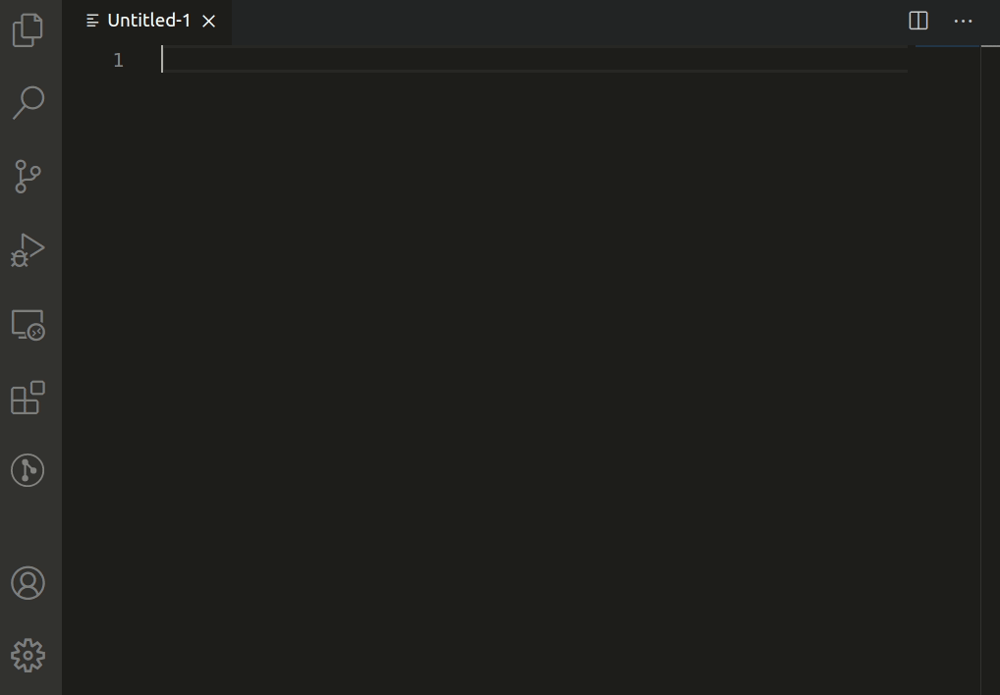

# step-line-generator README

This extension will search for string tempates **STEP-{}** and **LINE-{}** and generate a STEP counter and/or Line number. 

## Installation

[Visit Visual Studio Marketplace](https://marketplace.visualstudio.com/items?itemName=BenedictoTan.step-line-generator)

Launch VS Code Quick Open (Ctrl+P), paste the following command, and press enter.

```
ext install BenedictoTan.step-line-generator
```

## Features
* Generate Line number 
* Generate a step number

Type of templates:
* **STEP-{}**  , a step counter is incremented each time an instance is found on a different line.
* **LINE-{}**  , the current line number


*Before*
```
console.log ('LINE-{} STEP-{} Open your notebook');
console.log ('LINE-{} STEP-{} grab your pencil, say again  STEP-{}');
console.log ('LINE-{} STEP-{} Close your notebook');

```
*After*
```
console.log ('LINE-{1} STEP-{1} Open your notebook');
console.log ('LINE-{2} STEP-{2} grab your pencil, say again  STEP-{2}');
console.log ('LINE-{3} STEP-{3} Close your notebook');

```

## Demo



## Known Issues

## Release Notes

### 0.0.1

published